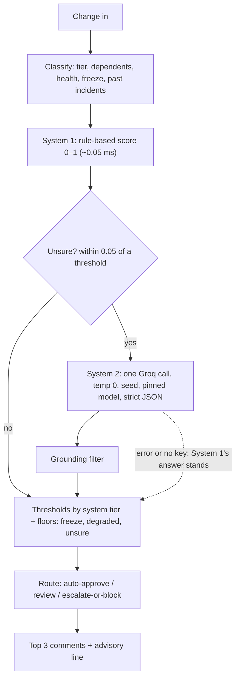

# CRA2 — ChangeRiskAdvisor 2

Pre-deployment change-risk advisor for Raj Sam, a DevOps engineer. Give it a
structured change and it returns:

- a risk **level** (low / medium / high) from a 0–1 score and per-system thresholds,
- a **recommended route**: auto-approve, review, or escalate-or-block,
- the **top 3 comments**, each grounded in the change, the system, or a past incident.

It is fast and deterministic. A rule-based classifier (System 1) answers most
changes in about 0.05 ms. Only changes it is unsure about go to a single Groq
call (System 2), with temperature 0, a fixed seed, a pinned model and a strict
JSON schema.

**Advisory only.** CRA2 never approves, blocks, merges or deploys anything. The
route is a recommendation, and a human makes the call. Only the deterministic
System 1 can recommend the auto-approve lane: a change it is unsure about is
always held for at least review, whatever the model says.

## Run it locally

You need [uv](https://docs.astral.sh/uv/getting-started/installation/) (it
installs Python 3.13 for you) and, for System 2, a Groq API key from
[console.groq.com/keys](https://console.groq.com/keys).

```sh
git clone https://github.com/rajesamp/CRA2.git
cd CRA2
uv sync

uv run cra2 CHG-02 --mode fast        # no key needed: System 1 only
cp .env.example .env                  # then set GROQ_API_KEY in .env
uv run cra2 CHG-16                    # auto: this change is borderline, so Groq is asked
uv run cra2 my-change.json --json     # your own change, full JSON result
uv run pytest -q                      # offline tests; the live Groq tests run when a key is set
```

`CHG-01` to `CHG-20` are the eval cases in [evals/cases.json](evals/cases.json).
A change file looks like this:

```json
{
  "id": "CHG-19",
  "service": "inventory-service",
  "change_type": "Config change",
  "summary": "Raise the stock-count cache TTL from 30 s to 120 s.",
  "deploy_plan": "",
  "rollback_plan": "Set the TTL back to 30 s.",
  "monitoring_plan": "Nightly reconciliation drift."
}
```

`service` is one of the eight services in
[data/checkout_system.json](data/checkout_system.json). `change_type` is one of
the types in [cra2/rules.json](cra2/rules.json). An empty plan counts as missing.

Output:

```
**Risk: MEDIUM** (score 0.38, core tier) · recommended route: **review**
_system1 · 0.165 ms_

1. [deploy-order] No deploy plan, and 4 services sit downstream (checkout-service, mobile-frontend, order-service, web-frontend). Ship backward-compatible first and stage the rollout. (change:deploy_plan, graph:inventory-service.dependents)
2. [rollback] Rollback plan: "Set the TTL back to 30 s". Rehearse it in staging and time it before the window. (change:rollback_plan)
3. [monitoring] Monitoring plan: "Nightly reconciliation drift". Check it covers stock reservation errors, nightly reconciliation drift. (change:monitoring_plan, catalog:inventory-service.monitors)

This is advisory only. The decision to ship requires a human.
```

| Mode (`--mode` or `CRA2_MODE`) | What runs | Needs a key |
|---|---|---|
| `fast` | System 1 only | No |
| `auto` (default) | System 1, plus one Groq call when System 1 is unsure | Only for unsure changes |
| `deep` | System 1 and a Groq call for every change | Yes |

## Architecture



The HLD, with the component diagram, request flow, scoring formulas,
thresholds table, determinism, grounding and failure modes, is in
[docs/architecture.md](docs/architecture.md). Why Groq, and which model is
pinned: [docs/adr/adr-001-groq.md](docs/adr/adr-001-groq.md).

## Latency

The earlier builds ran an agent loop: two to four model calls in sequence per
question, a growing prompt, and vector search (on a local 7B model in the
Ollama build). CRA2 makes zero model calls for most changes and exactly one
for the rest:

| Path | Latency | Source |
|---|---|---|
| System 1, per assessment | 0.047 ms p50, 0.082 ms p95 | measured, [docs/evidence/evals-fast.md](docs/evidence/evals-fast.md) |
| Whole `cra2` CLI process (Python start-up included) | about 50 ms | measured |
| System 2, one Groq call | not measured yet | Pending: run the live evals below. `tests/test_live_groq.py` fails if a call takes 5 s or more. |
| Same change asked again (same process) | microseconds | cache |

In the eval set, 18 of 20 changes never need Groq.

## Deterministic answers

The same change gives the same level and the same three comments:

- System 1 is plain arithmetic, so it is deterministic by construction.
- System 2 uses temperature 0, `seed`, a pinned model, low reasoning effort, and
  a strict JSON schema. Groq's `system_fingerprint` is recorded on each call.
- Comments are ranked in a stable order.

Regression tests: `tests/test_cra2.py` runs offline against a stand-in client.
`tests/test_live_groq.py` asks Groq five times with the cache cleared and
expects identical answers.

## Evals

[evals/cases.json](evals/cases.json) holds 20 changes to a made-up checkout
system. They cover all eight services, seven change types, 5 low, 8 medium and
7 high expected levels, freeze windows, a degraded dependency, missing
rollback, monitoring or deploy plans, and config drift. Each case has the
structured change, the expected answer, and a 10-point marking rubric (see
[evals/README.md](evals/README.md)).

```sh
uv run python scripts/run_evals.py --mode fast                  # System 1 only, no key
uv run python scripts/run_evals.py --mode deep --repeat 5 \
    --price-in <USD per 1M in> --price-out <USD per 1M out>     # Groq on every case, 5x each
```

The report goes to `docs/evidence/`. It covers rubric score, level and route
accuracy, System 2 call rate, determinism across repeats, latency p50/p95, token
use, and cost per 1,000 assessments.

## Configuration (`.env`)

| Variable | Default | Notes |
|---|---|---|
| `GROQ_API_KEY` | — | Needed for `auto` (unsure changes only) and `deep` |
| `CRA2_MODEL` | `openai/gpt-oss-20b` | Pinned. Change it only after an eval run. It must support strict JSON schema output. |
| `CRA2_MODE` | `auto` | `fast`, `auto` or `deep` |
| `CRA2_SEED` | `7` | Fixed sampling seed |
| `CRA2_TIMEOUT_S` | `10` | Groq request timeout, with 1 retry |
| `CRA2_MAX_TOKENS` | `1024` | Cap on reasoning plus answer tokens |

Risk rules (thresholds per tier, routes, System 1 weights and comment wording)
live in [cra2/rules.json](cra2/rules.json), so you can tune them without
touching code.

## Layout

| Path | Contents |
|---|---|
| `cra2/` | The package (193 lines of Python): `config.py`, `system1.py`, `system2.py`, `advisor.py`, `__main__.py`, plus `rules.json` and `prompts/` |
| `data/` | The made-up checkout system: service catalog and 16 past incidents |
| `evals/` | 20 eval cases with expected answers and rubrics |
| `scripts/run_evals.py` | Eval runner and report writer |
| `tests/` | Offline tests and live Groq tests |
| `docs/` | Architecture (HLD), ADRs, eval evidence |

## To do

- **Live Groq run.** Add a key, run the deep evals with `--repeat 5` and
  `tests/test_live_groq.py`, then record the results and confirm the model pin
  in ADR-001.
- **Latency regression after a merged change.** A function was added, merged
  and pushed, and latency then rose. This is tracked as a to-do, not an eval case.
- **Unseen eval cases.** System 1's weights were tuned with the 20 current
  cases in view. New cases are the real test of how well it generalises.
- **Free-text input.** Turn a plain-language change request into the
  structured change.
- **Optional web form.** It was left out to keep the package small.

## Relation to CRA

CRA2 is a separate repository and does not change
[rajesamp/CRA](https://github.com/rajesamp/CRA). Its data, incidents and eval
cases were written for CRA2.
