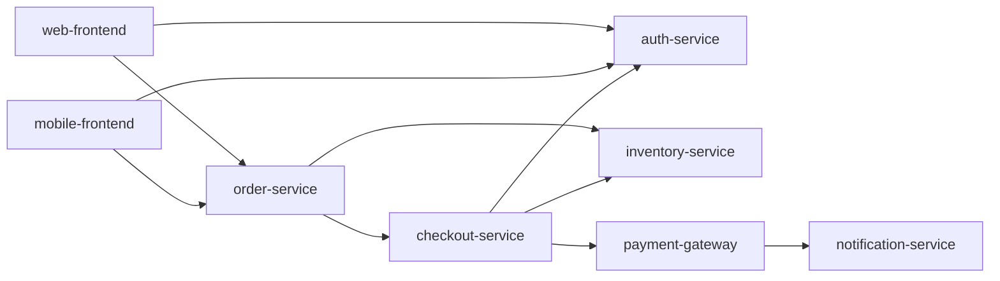

# Synthetic checkout-system data

These fixtures were written for CRA2. They do not describe production systems,
real incidents, or customers. The catalog is a static snapshot; CRA2 does not
query live health, freeze windows, config state, or an incident service.

| File | Contents |
|---|---|
| `checkout_system.json` | Eight services with tier, direct dependencies, health, freeze state, rollback guidance, monitors, and config-source/drift fields |
| `incidents.json` | Sixteen historical examples, `CX-101` through `CX-116`, with service, date, change type, severity, and root cause |

The snapshot marks `payment-gateway` as **Degraded** and marks `auth-service`
and `mobile-frontend` as being in a freeze window. The changed service and its
**direct** dependencies are checked for degraded health. Health is not traversed
recursively. The reverse dependency graph is traversed transitively to count
services affected by a failure.

Here, `A --> B` means A calls B:

## Evidence references

- `change:<field>` refers to a normalized change field. A missing plan is
  represented by an empty string and can be cited as absent evidence.
- `catalog:<service>.<field>` refers to the changed service or a direct
  dependency included in context.
- `graph:<service>.dependents` refers to transitive reverse dependencies;
  `graph:<service>.depends_on` refers to direct outgoing dependencies.
- An incident ID refers to one of at most five related incidents supplied to
  the assessment. Related incidents share the service or change type and are
  ordered by service match, type match, and incident ID. They are not ranked
  by recency or semantic similarity.

System 2 comments with unknown references are discarded. Matching a reference
to a supplied key is a structural check, not proof that the prose follows from
the fact. A reviewer still needs to inspect the change and relevant evidence.

## Editing and distribution

Edit these canonical JSON files in the repository. The wheel build includes
copies as `cra2/data/checkout_system.json` and `cra2/data/incidents.json`; normal
installs do not depend on the working directory. Keep dependency names, service
names, and incident IDs consistent, then run offline tests and the fast eval gate.
New operational integrations would need freshness checks and their own tests;
the synthetic snapshot provides neither.
