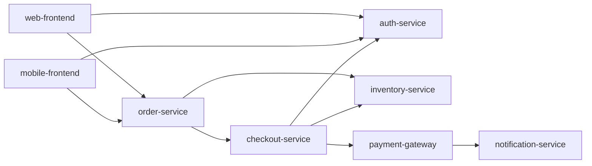

# Data: a made-up checkout system

All data here is synthetic and was written for CRA2. None of it comes from
production systems, real incidents or customers.

| File | Contents |
|---|---|
| `checkout_system.json` | 8 services. Each has a tier (`critical`, `core` or `standard`, which sets the risk thresholds), `depends_on` edges, current health, freeze-window flag, usual rollback method, key monitors, and where its config comes from (with a drift-prone flag). |
| `incidents.json` | 16 past incidents (`CX-101` to `CX-116`), each with service, date, change type, severity and root cause. |

State used by the eval cases: payment-gateway is **Degraded**, and auth-service
and mobile-frontend are in a **freeze window**.

Dependency graph (`A --> B` means A calls B):

## Evidence keys

Comments cite evidence with these keys, and CRA2 drops any System 2 comment
that cites something it was not given:

- `change:<field>`: a field of the change, such as `change:rollback_plan`.
  Citing a missing plan is allowed.
- `catalog:<service>.<field>`: a catalog fact about the changed service or one it
  calls directly, such as `catalog:payment-gateway.status`.
- `graph:<service>.dependents` or `graph:<service>.depends_on`: the dependency graph.
- An incident ID such as `CX-105`: an incident with the same service or change type.
