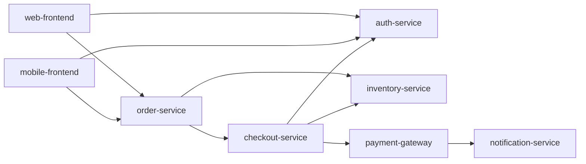

# Catalog and incident data

CRA2 combines an eight-service synthetic checkout catalog with 46 incident
records from two distinct sources. The original fixtures were written for CRA2;
the additional samples were supplied by the user as sanitized incident records,
with permission for public GitHub distribution and Groq assessment context.
The files preserve this distinction and the samples' original labels/provenance.
The catalog is a static snapshot; CRA2 does not query live health, freeze windows,
configuration state, or an incident service.

| File | Contents |
|---|---|
| `checkout_system.json` | Eight services with tier, direct dependencies, health, freeze state, rollback guidance, monitors, and config-source/drift fields |
| `incidents.json` | Sixteen original synthetic historical examples, `CX-101` through `CX-116`, with service, date, change type, severity, and root cause |
| `sample_incidents.json` | Thirty user-provided sanitized incident samples, retaining original service and change-type labels and source provenance |

The new samples span **2022-11-30 through 2026-09-27** and contain 28 distinct
external service labels. They cover eight deployment, seven infrastructure,
three capacity, seven configuration, two third-party, and three no-change
incidents. Their supplied severities are 10 SEV1, 3 SEV2, 11 SEV3, and 6 SEV4.
All 30 retain their supplied `source: "internal"` value; `source_dataset`
separately distinguishes the sample collection from synthetic history at runtime.
These labels do not create or map to catalog services, tiers, dependency edges,
or health states. The catalog remains the same eight-service synthetic system.

The snapshot marks `payment-gateway` as **Degraded** and marks `auth-service`
and `mobile-frontend` as being in a freeze window. The changed service and its
**direct** dependencies are checked for degraded health. Health is not traversed
recursively. The reverse dependency graph is traversed transitively to count
services affected by a failure.

Here, `A --> B` means A calls B:

## Evidence references

- `change:<field>` refers to a normalized change field. A missing plan is
  represented by an empty string and can be cited as absent evidence.
- `catalog:<service>.<field>` refers to the changed service or a direct
  dependency included in context.
- `graph:<service>.dependents` refers to transitive reverse dependencies;
  `graph:<service>.depends_on` refers to direct outgoing dependencies.
- An incident ID refers to one of at most five related records selected from
  both incident files and supplied to the assessment. Unselected incident IDs
  are not valid evidence references for that assessment.

System 2 comments with unknown references are discarded. Matching a reference
to a supplied key is a structural check, not proof that the prose follows from
the fact. A reviewer still needs to inspect the change and relevant evidence.

## Bounded incident retrieval

The candidate set includes an incident when its service matches exactly, its
normalized change type matches, or its text shares at least two informative
tokens with the change. Common filler words do not count as informative overlap.
Short technical terms such as `OOM`, `CPU`, `CDN`, `ACL`, and `503` remain useful
matches. This is local lexical matching, not embeddings or model-based semantic
search.

At most five candidates are retained in this order:

1. Same-service history with a matching normalized change type.
2. Other same-service history.
3. Cross-service candidates.

Within each group, more informative token overlap ranks first, followed by a
matching normalized type, newer date, and incident ID as a stable tie-break.

This lets a relevant capacity or no-change incident rank above an unrelated
deployment incident from another service.

The only type alias is `Deployment` → `Code deploy`, used for comparison without
rewriting the stored sample. Other labels stay distinct. External or no-change
categories without a matching type can enter through the two-token overlap
rule; they are not silently reclassified as deployments.

Cross-service matches are analogous history. They may inform a model's review,
but they do not trigger System 1's same-service repeat-incident penalty or imply
that the changed service suffered the external incident. Only same-service and
matching-type history establishes that repeat signal. Limiting the context to
five keeps the provider payload bounded; it does not guarantee that every
relevant record will be selected.

The JSON result's `incident_context` exposes the selected records. Each includes
`source_dataset` (`synthetic` or `sanitized_samples`), `match_kind`
(`same_service_history` or `cross_service_analogue`), and `matched_terms`.
These fields identify provenance and retrieval evidence; a lexical match does
not establish a causal relationship between the two services.

In `auto` or `deep`, selected samples can be included in Groq context along with
the synthetic records. `fast` uses local context only. No live Groq requests were
made to add these samples.

## Editing and distribution

Edit these canonical JSON files in the repository. The wheel build includes
copies under `cra2/data/`, including both incident files; normal installs do not
depend on the working directory. Preserve incident IDs, original labels, and
source provenance. Keep synthetic catalog dependencies valid without requiring
external sample services to appear in the catalog. Then run offline tests and
the fast eval gate. New operational integrations would need freshness checks
and their own tests; the static files provide neither.
