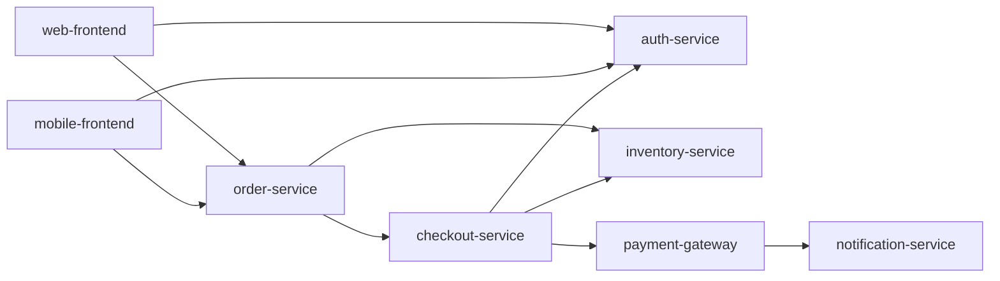

# Catalog and incident data

CRA2 combines an eight-service synthetic checkout catalog with 46 incident
records from two distinct sources. The original fixtures were written for
CRA2. The additional samples came from the user as sanitized incident records,
cleared for public GitHub distribution and Groq assessment context. The files
preserve that distinction and each sample's original labels and provenance.
The catalog is a static snapshot: CRA2 never queries live health, freeze
windows, configuration state, or an incident service.

| File | Contents |
|---|---|
| `checkout_system.json` | Eight services: tier, direct dependencies, health, freeze state, rollback guidance, monitors, config-source/drift fields |
| `incidents.json` | 16 original synthetic examples, `CX-101`–`CX-116`, with service, date, change type, severity, root cause |
| `sample_incidents.json` | 30 user-provided sanitized samples, keeping original service/type labels and provenance |
| `team_settings.json` | Bundled `sample-team` policy: `auth-service.high_risk = true`; unspecified fields keep lower-precedence values |

The samples span 2022-11-30 through 2026-09-27 and hold 28 distinct external
service labels. Coverage: eight deployment, seven infrastructure, three
capacity, seven configuration, two third-party, three no-change incidents.
Supplied severities: 10 SEV1, 3 SEV2, 11 SEV3, 6 SEV4. All 30 keep their
supplied `source: "internal"`; `source_dataset` separates the sample
collection from synthetic history at runtime. External labels never create or
map to catalog services, tiers, edges, or health states. The catalog stays
the same eight services.

The snapshot marks `payment-gateway` **Degraded** and reports active freeze
flags for `auth-service` and `mobile-frontend`. Those flags are unconfirmed
reports, not calendar checks: they produce verification questions and add no
risk weight or floor. Degraded-health checks cover the changed service and
its **direct** dependencies only. The reverse dependency graph is traversed
transitively to count services a failure would affect.

Team settings resolve after catalog/default and request values. Explicit team
booleans — including `false` — win, and conflicting request values surface in
the result. `high_risk = true` sets a medium minimum.
`CRA2_TEAM_SETTINGS_FILE` selects a replacement policy file. The bundled
policy and catalog are static local examples, not a multiuser authorization
system or live policy service.

Here, `A --> B` means A calls B:

## Evidence references

- `change:<field>` — a normalized change field. A missing plan is an empty
  string and can be cited as absent evidence.
- `catalog:<service>.<field>` — the changed service or a direct dependency
  included in context.
- `team:<service>.<field>`, `change:settings.<field>`, `default:<field>` —
  the source of an effective setting. Conflicts keep both the requested and
  effective team values.
- `graph:<service>.dependents` — transitive reverse dependencies;
  `graph:<service>.depends_on` — direct outgoing dependencies.
- An incident ID — one of at most five related records from both incident
  files, supplied to that assessment. Unselected IDs are invalid evidence
  references for that assessment.

System 2 comments with unknown references are discarded. Matching a reference
to a supplied key is a structural check, not proof the prose follows from the
fact. A reviewer still inspects the change and the evidence.

## Bounded incident retrieval

A candidate is exact-service history or a cross-service incident sharing at
least two meaningful terms with the change. A matching normalized change type
alone never qualifies a cross-service incident. Filler words do not count as
informative overlap; short technical terms (`OOM`, `CPU`, `CDN`, `ACL`,
`503`) do. This is local lexical matching — no embeddings, no semantic
search.

At most five candidates are kept, in this order:

1. Same-service history with a matching normalized type.
2. Other same-service history.
3. Cross-service candidates.

Within each group: more token overlap first, then matching normalized type,
then newer date, then incident ID as a stable tie-break. A relevant capacity
or no-change incident can therefore outrank an unrelated cross-service
deployment incident.

The only type alias is `Deployment` → `Code deploy`, used for comparison
without rewriting stored samples. Other labels stay distinct. Every
cross-service category — deployment and no-change included — needs the
two-term rule; samples are never silently reclassified as deployments.

Cross-service matches are analogous history. They may inform review, but they
never trigger System 1's same-service repeat penalty and never imply the
changed service suffered the external incident. Only same-service,
matching-type history establishes that repeat signal. The five-record cap
bounds the provider payload; it does not guarantee every relevant record is
selected.

`incident_context` exposes the selected records, each with `source_dataset`
(`synthetic` or `sanitized_samples`), `match_kind` (`same_service_history` or
`cross_service_analogue`), and `matched_terms`. These fields identify
provenance and retrieval evidence; a lexical match does not establish
causation between services.

In `auto` or `deep`, selected samples may join synthetic records in Groq
context. `fast` uses local context only. No live Groq requests were made to
add the samples.

## Editing and distribution

Edit the canonical JSON files in the repository. The wheel build copies them
under `cra2/data/`, including both incident files, so normal installs do not
depend on the working directory. Preserve incident IDs, original labels, and
provenance. Keep synthetic catalog dependencies valid without requiring
external sample services in the catalog. Then run offline tests and the fast
eval gate. New operational integrations would need freshness checks and their
own tests; these static files provide neither.
