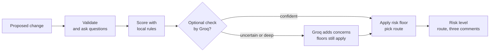

<!-- Product-owner overview. Engineering detail lives in architecture.md. -->
# How CRA2 works — a two-page overview

CRA2 reads a proposed software change and returns three things:

1. A **risk level** — `low`, `medium`, or `high`.
2. A **review route** — `routine-review`, `focused-review`, or
   `priority-review`.
3. **Three comments** — each with a citation to the fact it is based on.

It never approves, rejects, blocks, merges, or deploys. Routes rank review
attention for the human who decides. That sentence is the product.

## The journey of one change



Five stops, in order:

| Stop | What happens | What can go wrong here |
|---|---|---|
| 1. Validate | Check the JSON shape, limits, secrets | Bad input → targeted questions, nothing scored |
| 2. Score | Local rules add weights (missing rollback = +0.20, and so on) | Score near a threshold → flag as `uncertain` |
| 3. Optional check | Groq (System 2) reviews when uncertain or in `deep` mode | No key / bad reply → keep local result, add note |
| 4. Floor | Highest of: local level, blended level, policy floors | A high-risk service → at least `medium` |
| 5. Result | Map level → route, emit 3 comments + advisory | — |

## One real change, end to end

Input (`CHG-02`, run entirely locally with `--mode fast`):

```json
{
  "id": "CHG-02",
  "service": "web-frontend",
  "change_type": "Feature flag rollout",
  "summary": "Show a new promo banner on the cart page behind the promo_banner_v2 flag.",
  "deploy_plan": "Flag to 5% of sessions, then 50%, then 100% over two days.",
  "rollback_plan": "Turn promo_banner_v2 off.",
  "monitoring_plan": "JS error rate and checkout button click-through on the rollout dashboard."
}
```

Score rules (from `cra2/rules.json`, standard tier shown):

- Missing rollback plan: +0.20
- Missing monitoring plan: +0.10
- Config change on a drift-prone service: +0.10
- Missing deploy plan when dependents exist: +0.05
- Same-service incident of the same type: +0.15 each (cap 0.30)
- Degraded service or direct dependency: +0.05

Output:

> **Risk: LOW** (score 0.10, standard tier) · review focus: **routine-review**
>
> 1. [rollback] Rollback plan: "Turn promo_banner_v2 off". Rehearse it in staging and time it before the window. *(change:rollback_plan)*
> 2. [monitoring] Monitoring plan: "JS error rate and checkout button click-through...". Check it covers JS error rate, checkout button click-through. *(change:monitoring_plan, catalog:web-frontend.monitors)*
> 3. [dependencies] Downstream services that feel a failure here: none. *(graph:web-frontend.dependents)*
>
> This is advisory only. The decision to ship requires a human.

Reading the output:

- **Score 0.10** = the sum of rule weights. This change triggers none of the
  risk rules; its baseline (feature flag + standard tier) is 0.10.
- **Low → routine-review** = the route table. Every level has one route.
- **Parenthesized keys** = exactly which field each comment rests on. They
  trace back to the change text or a catalog record.
- **The advisory line** = always present, in every mode, in every result.

## What you always get / never get

| You always get | You never get |
|---|---|
| A risk level, score, and route for every assessable change | An approval, rejection, or deployment action |
| Exactly three comments, each with a citation | An opinion without a cited fact |
| Targeted questions instead of a guess when input is vague | A guessed answer to a vague request |
| A visible floor when policy raises risk | A model that can quietly lower a rule-based level |
| Unconfirmed-freeze status with a verification question | A claim that a freeze is (or is not) live |

## Three guarantees to remember

1. **Advisory only.** Output ranks review attention; a human ships.
2. **Risk only goes up.** Local rules set a floor. Groq can raise the level,
   never lower it. Degraded/high-risk/uncertain floors stack on top.
3. **A freeze report is a question, not a fact.** Reported freezes show
   `unconfirmed` and ask for verification; they add zero risk weight.

## Where to go deeper

- Full mechanics, scoring math, cache/telemetry semantics: [architecture.md](architecture.md)
- What the local rules weigh and why: `cra2/rules.json`
- The 20 calibration cases and the quality gate: [../evals/README.md](../evals/README.md)
- Data sources and provenance: [../data/README.md](../data/README.md)
