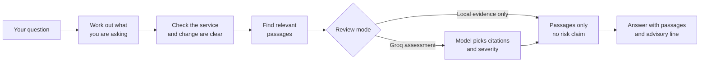

<!-- Product-owner overview. Engineering detail lives in architecture.md. -->
# How CRA2 works

CRA2 is a chat app. You describe a change in plain English. It answers with:

1. **A risk indication** — `low`, `medium`, or `high`, always labeled
   uncalibrated. Groq assessment mode only; local evidence mode gives no risk
   claim.
2. **Review questions** for the human who decides.
3. **The passages it based that on** — pulled from your incident records,
   postmortems, and runbooks, each with an ID you can open.

It never approves, rejects, blocks, merges, or deploys. That sentence is the
product.

## One question, end to end

You type:

> How risky is changing checkout-service config timeout from 4 seconds to 400
> milliseconds?

With **Groq assessment** selected, CRA2 answers:

> **Risk indication: HIGH** — uncalibrated historical assessment. Current health
> is unverified.
>
> **Review questions**
>
> - Does this change repeat the cited failure mechanism?
> - How will recovery and monitoring be verified?
>
> **Evidence · historical/sample**
>
> - The timeout for payment-gateway calls was cut from 4 seconds to 400
>   milliseconds. Slow authorisations were abandoned while still in flight.
>   Some shoppers were charged even though no order was created.
>   (pm-cx101-checkout-timeout#chunk-001)
> - Guidance: Runbook: review a checkout-service config change
>   (rb-checkout-config-risk#chunk-001)
>
> This is advisory only. The decision to ship requires a human.

With **Local evidence only** selected, the same question returns the same
passages with a different header:

> Local evidence only; no model risk indication.
>
> **Evidence · historical/sample**
>
> - Guidance: Runbook: review a checkout-service config change
>   (rb-checkout-config-risk#chunk-002)
> - The timeout for payment-gateway calls was cut from 4 seconds to 400
>   milliseconds. … (pm-cx101-checkout-timeout#chunk-001)
>
> This is advisory only. The decision to ship requires a human.

Both outputs are real, captured from the app. Note the difference: local mode
makes **no** risk claim at all, and Groq mode labels its own answer *HIGH —
uncalibrated* and says current health is unverified. Everything under
**Evidence** is a real passage you can open and read, and the parenthetical
after each one is its ID. That is the point: you never have to trust a claim
you cannot inspect.

## What happens behind the answer

Six steps:

| Step | What happens | If something is missing |
|---|---|---|
| 1. Understand | Works out whether you want risk, history, dataset facts, or help | Off-topic question gets one short reply with a link |
| 2. Identify | Confirms you named one known service and a concrete change | Asks which service, or what specifically changes |
| 3. Retrieve | Finds the closest passages in your corpus | Says it found no usable evidence rather than guessing |
| 4. Assess | Optionally asks the model to read the passages and pick citations | No key or a failed call drops to passages only |
| 5. Ground | Discards any comment citing a passage it was not given | — |
| 6. Answer | Risk indication, review questions, passages, advisory line | — |

## Six kinds of question

| You ask | You get | Status |
|---|---|---|
| "How risky is changing checkout-service timeout to 400 ms?" | A risk indication and review questions in Groq mode; passages only in local mode | `assessed` / `evidence_only` |
| "Have checkout-service retry config changes caused incidents before?" | The matching incidents, labeled historical | `history_only` |
| "How many incidents do you have?" | A count, no model call | `dataset_count` |
| "Just approve this change for me." | A clear no, plus an offer to assess it | `advisory_boundary` |
| "Is this a freeze window right now?" | "Cannot confirm current state — treat as unconfirmed" | `deferred` |
| "What's the capital of France?" | One sentence and a link. No retrieval, no model. | `out_of_scope` |

The last two matter most. CRA2 refuses to approve anything, and it says when it
*cannot* know something instead of inventing an answer.

## Two review modes

Pick one in the UI:

| Mode | What you get | Needs a Groq key |
|---|---|---|
| **Local evidence only** | The passages, plus "no model risk indication." No risk level at all. No network. Identical every run. | No |
| **Groq assessment** | The passages, a model-chosen risk indication labeled *uncalibrated*, and two fixed review questions | Yes |

Local evidence only is the safe choice for a demo or a sensitive change: there
is no model, so the answer cannot drift between runs. Groq assessment gives you
a risk level to act on, and labels it as uncalibrated every time.

## What you always get / never get

| You always get | You never get |
|---|---|
| Passages you can open, or a clarifying question | An approval, rejection, or deployment action |
| A risk indication labeled uncalibrated, or none at all | A confident, calibrated-sounding risk claim |
| Comments citing passages you can read | An opinion with no cited source |
| Unconfirmed-freeze wording with a verification question | A claim that a freeze is live |
| An explicit "I can't confirm this" | Silence about its own limits |

## Three guarantees

1. **Advisory only.** The app ranks review attention. A human ships.
2. **A risk claim needs a citation.** Any comment the model produced is
   discarded unless it cites a passage the app actually retrieved.
3. **A freeze report is a question, not a fact.** Reported freezes show
   `unconfirmed`, ask for verification, and add zero risk weight.

## Where to go deeper

- Full mechanics, scoring math, cache and telemetry semantics:
  [architecture.md](architecture.md)
- What the checklist weighs and why: `cra2/rules.json`
- The 20 calibration cases and the quality gate:
  [../evals/README.md](../evals/README.md)
- Where the passages come from, and their provenance:
  [../data/README.md](../data/README.md)
- Starting the app: [../week1/README.md](../week1/README.md)