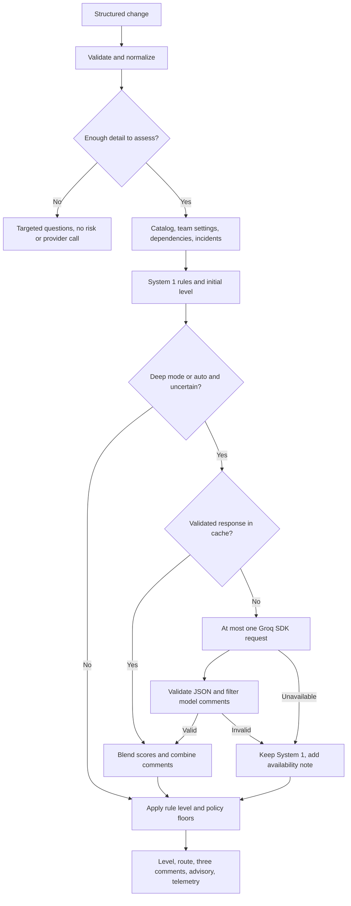

# CRA2 architecture

New to CRA2 or explaining it to a stakeholder? Start with the
[two-page overview](architecture-overview.md). This page is the engineering
reference: scoring math, cache semantics, and telemetry fields.

CRA2 is a synchronous Python library and CLI over a static, synthetic checkout
system. Per request, it:

1. Validates a structured change.
2. Computes a rule score (System 1).
3. Optionally requests a Groq assessment (System 2).
4. Applies risk floors.
5. Returns three comments.

It never deploys, approves, blocks, or mutates a repository. Incomplete intent
returns clarification questions — no risk assessment, no provider request. All
routes describe review attention, never a ship decision. Incident context
combines 16 synthetic records with 30 sanitized user-provided samples; the
samples keep their original labels and never expand the catalog.

## Pipeline

| Component | Responsibility |
|---|---|
| `cra2/__main__.py` | Read a sample ID, JSON file, or stdin; report argument/input errors |
| `cra2/config.py` | Validate environment settings; opt-in dotenv; locate packaged/source resources |
| `cra2/advisor.py` | Input validation, context, selection gate, floors, comment order, rendering |
| `cra2/incidents.py` | Load and validate both incident sources; rank and annotate up to five records |
| `cra2/team_settings.py` | Validate team/request booleans; resolve precedence; expose sources/conflicts |
| `cra2/system1.py` | Deterministic rule scoring and evidence-linked comment templates |
| `cra2/system2.py` | Groq request, response validation, output hygiene, usage accounting, bounded cache |
| `cra2/rules.json` | Thresholds, weights, route labels, and local comment wording |
| `scripts/run_evals.py` | Offline/live evaluation, all-repeat quality gate, scoped evidence report |

Canonical fixtures stay in `data/` and `evals/`. The wheel build maps them into
`cra2/data/` and `cra2/evals/`, so package execution needs no source checkout.
The repository evaluation script reads its source case file and is not an
installed command.

## Input and context

An assessable request needs a known `service`, a supported `change_type`, and
a concrete `summary`. Anything less returns
`status: "needs_clarification"` with targeted questions and null risk, score,
and route. No incident context or model request is produced.

The summary heuristic strips generic terms and service/type tokens, then
requires at least two distinct informative terms remaining. It is lexical; it
does not understand every vague or contradictory request.

Input rules:

- Optional fields: string `id`, three plan strings (`deploy_plan`,
  `rollback_plan`, `monitoring_plan`), and `settings`. An omitted or null plan
  normalizes to an empty string.
- Settings accept only booleans `freeze_window_active` and `high_risk`.
- Whitespace is trimmed; invalid types, unknown fields, and strings over
  10,000 characters are input errors before any provider request.
- A clarification need is distinct from malformed JSON or an invalid type.
- Fields reject Unicode category-C characters except tabs, CR, and LF.
- The CLI caps file/stdin input at 1,048,576 decoded characters and rejects
  duplicate JSON keys and excessive nesting.

Context includes the service record, transitive reverse dependents, and at
most five incidents from the 46-record collection. A candidate matches if it
belongs to the exact service or shares at least two meaningful terms with the
change; cross-service type matches alone never qualify. Ranking order:

1. Exact service; within it, matching normalized type first.
2. Cross-service candidates by token overlap count, then matching normalized
   type, then newer date, with incident ID as a stable tie-break.

Short technical terms (`OOM`, `CPU`, `CDN`, `ACL`, `503`) are retained. The
only comparison alias is `Deployment` → `Code deploy`; stored labels stay
unchanged. This lexical retrieval uses no embeddings and no provider request.

Cross-service records are analogous history only. They cannot establish a
same-service repeat signal, fabricate catalog facts, or create an acceptable
new service. The collection holds 28 external sample service labels; the
catalog still has eight services.

Selected records surface as `incident_context` and in provider context, capped
at five. Each carries `source_dataset` (`synthetic` or `sanitized_samples`),
`match_kind` (`same_service_history` or `cross_service_analogue`), and
`matched_terms`. These annotations explain selection and provenance; they
never assert that analogous services share an incident.

The changed service and its **direct** outgoing dependencies are checked for
degraded health — not recursively. Graph traversal handles cycles and never
counts the changed service as its own dependent. The static fixture is not
live operational state.

The model receives the normalized change, primary and direct-dependency
catalog records, related incidents, dependent names, degraded names, allowed
evidence keys, and System 1 signals. A Groq request sends this context off the
local machine; `fast` mode never selects this path. The user authorized the
sanitized samples for public GitHub and provider context; adding them required
no live Groq calls.

## Team settings and freeze uncertainty

`data/team_settings.json` names the sample team and marks `auth-service` as
`high_risk`. `CRA2_TEAM_SETTINGS_FILE` selects a replacement JSON file;
working-directory files are never discovered. Catalog services may configure
only the booleans `freeze_window_active` and `high_risk`.

Precedence: catalog/default → request settings → explicitly present team
settings. An explicit team `false` overrides a request `true`. The result's
`settings` carries the team, effective booleans, and source evidence keys.
`settings_conflicts` lists each request/team disagreement with field,
requested value, effective value, and source. This is process-level local
policy, not tenant identity or an authorization boundary.

An effective active freeze produces `freeze.status = "unconfirmed"` with the
reported-active flag, source evidence, and a verification question.
Otherwise the status is `not_reported`, which does not prove a freeze is
absent. The freeze signal has zero score weight and imposes no floor. An
assessment can stay `assessed` while asking the reviewer to confirm freeze
status.

## Scoring and policy floors

System 1 adds:

- Change-type base weight
- Tier weight
- Transitive reverse dependents: 0.02 each, capped at 0.08
- Applicable rule weights

Total capped at 1.0, rounded to two decimals.

| Rule | Weight |
|---|---|
| Reported active freeze | 0 — explicit unconfirmed status + verification question |
| Same-service incident, matching normalized type | 0.15 each, capped at 0.30; cross-service analogies add nothing |
| Missing rollback plan | 0.20 |
| Missing monitoring plan | 0.10 |
| Config change on drift-prone service | 0.10 |
| Missing deploy plan on service with dependents | 0.05 |
| Changed service or direct dependency degraded | 0.05 |

Tier thresholds:

| Tier | Low | Medium | High |
|---|---|---|---|
| `critical` | < 0.20 | 0.20–0.49 | ≥ 0.50 |
| `core` | < 0.30 | 0.30–0.59 | ≥ 0.60 |
| `standard` | < 0.40 | 0.40–0.69 | ≥ 0.70 |

Degraded health or effective `high_risk = true` forces at least medium. A
freeze report alone never elevates risk. System 1 is **uncertain** when the
minimum distance between its score and a tier threshold, rounded to two
decimals, is less than 0.05. Exactly 0.05 stays outside the gate. An uncertain
assessment is at least medium in every mode, including `fast` and provider
fallback.

System 2 rates five areas: deploy order, rollback, config drift, dependencies,
and monitoring. Ratings map none=0, low=0.33, medium=0.67, high=1. Its score
is `0.6 × max + 0.4 × mean`, rounded to two decimals. A successful response is
blended equally with the System 1 score under current rules.

The final level is the greater of the blended score's tier band and the risk
floor, and the floor is never below the initial System 1 level. A benign model
reply therefore cannot reduce a rule-based medium/high result to low. The
numeric blended score can sit below the displayed level's threshold;
`risk_floor` and `system1_level` explain why. Routes: low → `routine-review`,
medium → `focused-review`, high → `priority-review`, always with the advisory
notice. No route authorizes approval, rejection, or deployment.

## Provider contract and grounding limits

Requests use temperature zero, the configured integer seed, a model ID, a
completion-token cap, a strict JSON schema, and a finite timeout. The default
model uses low reasoning effort with reasoning excluded from the reply.
Automatic SDK retries are off. Cache hits and missing credentials can mean no
SDK request at all.

Groq's [structured-output documentation](https://console.groq.com/docs/structured-outputs)
lists `openai/gpt-oss-20b` as supporting strict mode. A live request on
2026-09-28 nevertheless returned HTTP 400 with `unsupported_uniqueItems` for
`/properties/comments/items/properties/evidence`. Model-level strict support
does not establish support for every JSON Schema keyword.

CRA2 projects the provider-facing schema by omitting only `uniqueItems`,
keeping strict mode and all other constraints. The local schema is unchanged:
evidence uniqueness is still checked locally before a response is used or
cached. One bounded live assessment succeeded with this projection — That
confirms compatibility for that request only, not model quality or
fresh-response repeatability.

Local validation rejects missing/extra response fields, invalid rating enums,
wrong types, oversized strings/arrays, duplicate JSON keys, nonfinite numbers,
empty choices, refusals, and incomplete completions. Provider schema support
is never trusted as the only validator. Expected provider/response failures
are wrapped as `System2Unavailable`, with usage retained when the response
supplied it. Programming errors outside this boundary are not treated as
outages.

Comments with unknown evidence keys, disallowed execution/approval wording,
control characters, links, or markup are filtered. Surviving model comments
join rule comments in stable severity order; rule comments win equal-severity
ties. The first comment per distinct tag is kept, up to three. Local fallback
comments fill missing areas. Rendering escapes untrusted inline text and
strips terminal control characters.

These checks establish structure and citation membership. They do not prove
model prose is factual or that every prompt injection is caught. Risk floors
constrain the model's authority independently of its wording.

Exact known configured/SDK-held API keys are rejected from checked inputs,
payloads, response text/metadata, and cache flows. Expected provider failures
detach their exception chains. Groq/HTTP-client namespace logging is
suppressed to reduce debug-header exposure, and the client uses a fixed API
endpoint. These are scoped application controls: they do not detect unknown,
encoded, or transformed secrets or govern caller logs, memory inspection, or
provider retention. Cache storage is process-local memory only.

## Cache, repeatability, and telemetry

The process-local LRU cache holds up to 512 successful validated responses.
Cache identity includes the serialized normalized context plus the
request-affecting model, seed, temperature, token cap, timeout, reasoning
settings, prompt, and schema. Failed replies are never cached. Cache data
stays in memory until eviction, explicit clearing, or process exit.
Concurrent misses may each request the same answer; the cache provides no
single-flight guarantee.

System 1 results are deterministic for fixed input and policy data, timing
excluded. A cache hit reuses a validated model answer. Fresh Groq responses
stay best effort: sampling settings and schema do not guarantee identical text
or reasoning across requests or backend changes. Model IDs are not immutable
version pins, and fingerprints may be absent.

| Result field | Meaning |
|---|---|
| `status` | `assessed` or `needs_clarification`; clarification has null risk/score/route, no provider call |
| `questions` | Clarification or freeze-verification questions; freeze questions may accompany assessed results |
| `freeze` | Reported-active status, explicit uncertainty, source evidence; null for clarification |
| `settings` / `settings_conflicts` | Effective policy and provenance, plus request/team disagreements |
| `path` | `system2`, `system1`, or `clarification` |
| `system2_attempted` | System 2 was selected by mode/confidence rules |
| `system2_request_attempted` | SDK request method was invoked; not proof of provider receipt |
| `system2_cache_hit` | Validated response reused without a new request |
| `system2.tokens` | Input/output usage for this request, or null when missing; cache hits have `[0, 0]` |
| `system2.groq_ms` | Provider-reported duration when available; null for missing timing or cache hits |
| `system2_failure_usage` | Usage/timing retained for a rejected response; unknown values stay null |
| `latency_ms` | In-process wall time, including requested-provider failures |

A fallback's `path=system1` does not imply Groq was never attempted or that no
cost was incurred. The evaluator counts attempts separately and refuses a
complete token-cost estimate when any attempt lacks usage.

## Verification and limitations

Offline tests cover validation, policy floors, malformed model output, cache
identity, rendering, accounting, and package-resource contracts. CI also
builds a wheel and checks the installed CLI outside the checkout. CI targets
Python 3.10 and 3.13 and runs a five-repeat fast calibration gate. The gate
scores every repeat; one good first response cannot hide later regressions.
Unexpected clarification fails a calibration case without crashing the scorer.
Repeatability covers status, questions, freeze state, settings, and conflicts,
as well as score, level, route, and comments.

The [fast report](evidence/evals-fast.md) preserves the pre-enrichment
code-overhaul run and its UTC window. Its latency excludes CLI startup and is
neither an operational guarantee nor a benchmark of the enlarged incident set.
The 20-case dataset informed the weights; incident context adds no labeled
cases. Unseen-change quality is unmeasured. Live Groq tests need explicit
opt-in and credentials; live quality, latency, cost, and repeatability are
unverified by the offline suite. No Caveman project telemetry was available
for this review; repository metrics must not be relabeled as Caveman cost or
savings evidence. The [current policy report](evidence/evals-policy-fast.md)
records the updated review routes, settings, and freeze-verification behavior
on the calibration set.

Not implemented: hosted service, multiuser IAM, ingress/egress control plane,
live catalog or freeze synchronization, postmortem ingestion. Cross-process or
multiuser reproducibility needs common policy/data versions and an operational
design; the process-local cache does not provide it. See the [FAQ](faq.md).
