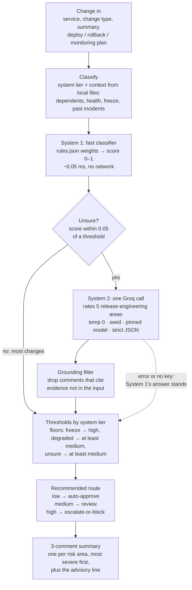
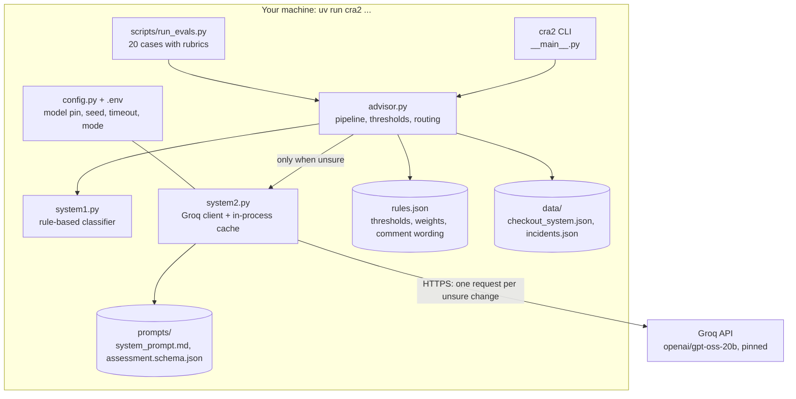
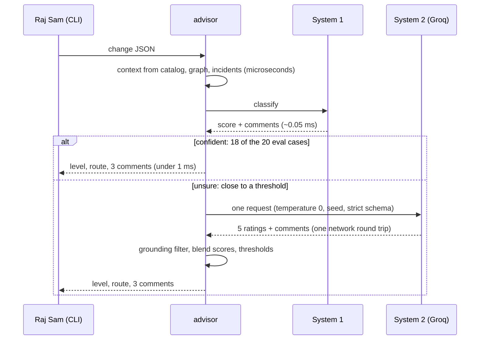

# CRA2 architecture (HLD)

CRA2 reads a structured change, scores its risk from 0 to 1, maps the score to a
level with thresholds that depend on the type of system, recommends a route,
and explains the result in three grounded comments. A fast rule-based
classifier (System 1) answers most changes in well under a millisecond. Only
changes it is unsure about go to one Groq call (System 2). CRA2 is advisory
only: it recommends a route, and a human decides whether to ship.

## 1. Pipeline

| Step | Where | What it does |
|---|---|---|
| Change in | `__main__.py` | Reads an eval case ID, a change JSON file, or stdin. |
| Classify | `advisor.context()` | Looks up the service's tier, dependents (transitive), degraded services on its path, freeze window, and past incidents of the same service or change type. It also lists the evidence keys the change may cite. |
| Assess risk (System 1) | `system1.py` | Adds rule weights from `rules.json` into a 0–1 score. Each rule that fires gives one grounded comment. |
| Assess risk (System 2) | `system2.py` | Only when System 1 is unsure, or in `deep` mode. One Groq call rates deploy order, rollback, config drift, dependencies and monitoring (none / low / medium / high) and writes comments. |
| Thresholds | `advisor.grade()` | Maps the score to low / medium / high using the tier's thresholds, then applies the floors: freeze → high, degraded → at least medium, unsure → at least medium. |
| Route | `rules.json` `routes` | low → auto-approve, medium → review, high → escalate-or-block. |
| Summary | `advisor.assess()`, `render()` | The top 3 comments, one per risk area, most severe first, plus the advisory line. |

## 2. Components

| File | Lines | Role |
|---|---|---|
| `cra2/config.py` | 16 | Groq settings from `.env`: pinned model, seed, temperature 0, token cap, timeout, mode |
| `cra2/system1.py` | 35 | Fast rule-based classifier |
| `cra2/system2.py` | 38 | The single Groq call: strict JSON schema, cache, token and latency capture |
| `cra2/advisor.py` | 74 | Context, confidence gate, blend, thresholds, floors, route, top 3 comments |
| `cra2/__main__.py` | 29 | Command line |
| `cra2/rules.json` | data | The ruleset: thresholds per tier, routes, System 1 weights and comment wording |

## 3. Request flow and latency

Why the earlier builds were slow, and what CRA2 changes:

| | CRA (Gemini, agent loop) | LocalCRA (Ollama, agent loop) | CRA2 |
|---|---|---|---|
| Model calls per question | 2 or more in sequence: a tool call, then the answer | 2 to 4 in sequence: search, health, dependencies, then the answer | 0 (System 1) or exactly 1 (System 2) |
| Where the model runs | Google cloud | A local 7B model on your own CPU or GPU | Nowhere for System 1; Groq for System 2 |
| Retrieval | ChromaDB and a local embedding model | Same | Dictionary lookups over two small JSON files |
| Prompt size | Grows with every tool result, re-sent on every call | Same | One compact payload, about 1,000 tokens |
| Repeat question | Full rerun | Full rerun | Answered from the in-process cache in microseconds |

Measured here (container CPU, `scripts/run_evals.py --mode fast --repeat 5`):
System 1 takes 0.047 ms at p50 and 0.082 ms at p95 per assessment in-process,
and a whole `cra2` CLI process takes about 50 ms. The Groq SDK is imported only
when System 2 runs, because importing it takes about 0.2 s. System 2 latency
has not been measured yet: this container cannot reach `api.groq.com`. The
live eval run records it (see [ADR-001](adr/adr-001-groq.md)).

## 4. Scoring and routing

System 1 score = change-type base + tier weight + 0.02 per downstream service
(max 0.08) + the weight of every rule that fires, capped at 1.0:

| Rule | Weight | Comment area |
|---|---|---|
| Freeze window active | 0.30 (and the level becomes high) | freeze |
| Same service and change type failed before | 0.15 per incident, max 0.30 | history |
| No rollback plan | 0.20 | rollback |
| No monitoring plan | 0.10 | monitoring |
| Config change on a drift-prone service | 0.10 | config-drift |
| No deploy plan and the service has dependents | 0.05 | deploy-order |
| Service or a direct dependency is degraded | 0.05 (and the level is at least medium) | health |

System 2 score = 0.6 × worst rating + 0.4 × mean rating, where none = 0,
low = 0.33, medium = 0.67 and high = 1. When System 2 runs, the final score is
the mean of the System 1 and System 2 scores. The floors still apply, so the
model cannot talk a frozen or degraded change down.

**Only System 1 can auto-approve.** An unsure change is at least medium
(review), whatever System 2 says. So neither the model nor text injected into a
change description can put a change in the auto-approve lane. System 2 can
raise a borderline change to high, or settle a high/medium borderline, and it
writes the comments.

Thresholds depend on the type of system. A score is low below the first number,
medium below the second, and high at or above it:

| Tier | Services | Low (auto-approve) | Medium (review) | High (escalate-or-block) |
|---|---|---|---|---|
| critical | checkout-service, payment-gateway | < 0.20 | < 0.50 | ≥ 0.50 |
| core | order-service, inventory-service, auth-service | < 0.30 | < 0.60 | ≥ 0.60 |
| standard | notification-service, web-frontend, mobile-frontend | < 0.40 | < 0.70 | ≥ 0.70 |

System 1 is unsure when its score is within 0.05 of a threshold and no freeze
applies. All numbers live in `cra2/rules.json`.

## 5. Deterministic answers

The same change must give the same level and the same three comments every time.

- System 1 is plain arithmetic over fixed inputs, so it is deterministic by construction.
- System 2 uses temperature 0, a fixed seed (`CRA2_SEED`), a pinned model
  (`CRA2_MODEL`), low reasoning effort, and a strict JSON schema with enums for
  ratings, areas and severities. Groq documents seeded sampling as best effort,
  so each result records the backend's `system_fingerprint`.
- Comments are ranked by severity with a stable tie-break, and at most one is
  kept per risk area.
- A repeat of the same change inside one process is served from the cache.
- `tests/test_cra2.py` checks the request settings and five identical runs
  against a stand-in client. `tests/test_live_groq.py` asks Groq the same
  change five times with the cache cleared and expects identical answers. It
  runs when `GROQ_API_KEY` is set.

## 6. Grounding

Every comment must cite evidence keys from the input: `change:<field>`,
`catalog:<service>.<field>`, `graph:<service>.dependents` or an incident ID
such as `CX-101`. System 1 builds its comments from those facts. System 2 is
given the allowed keys, and any comment that cites anything else is dropped
before the top 3 are picked. If fewer than three survive, System 1's comments
fill the gap.

## 7. System 1 and System 2: where the fast classifier fits

CRA2 follows the fast/slow ("System 1 / System 2") pattern. A cheap,
deterministic classifier handles what it is sure about. A slower, more capable
model is consulted only when that classifier is unsure. In this pipeline the
fast classifier does four jobs:

1. **Classify and score every change** (the classify and assess steps). It gives
   a score, a level and three grounded comments without a model.
2. **Gate System 2.** Groq is called only when the score is within the
   confidence margin of a threshold. In the eval set, that is 2 of 20 changes.
3. **Hold hard rules the model cannot override.** A freeze window forces high,
   and a degraded path forces at least medium. Only a confident System 1 can
   put a change in the auto-approve lane: an unsure change is held for at least
   review, whatever System 2 says.
4. **Check System 2.** The grounding filter is a System 1 check on the model's
   output: comments with evidence outside the input are dropped.

Next steps for System 1, once there are real labelled changes:

- Swap the hand-set weights for a small trained classifier, such as logistic
  regression over the same features. It would still take microseconds and run
  offline.
- Add a System 1 extractor so free-text change requests can be turned into the
  structured change.

## 8. Failure modes

| Failure | Behaviour |
|---|---|
| No `GROQ_API_KEY`, Groq down, timeout (10 s, 1 retry), empty reply | System 1's answer stands, and the output says System 2 was unavailable. An unsure change is held for at least review, as always. |
| Model returns ungrounded comments | Dropped, and System 1's comments fill in. |
| Prompt injection in a change description | The prompt treats change text as data. The model cannot auto-approve, and it cannot override the freeze or degraded floors. |
| Unknown service or missing field | Clear error from the CLI, with the list of known services. |
| Groq backend changes | `system_fingerprint` is recorded per call. Rerun the live tests and evals before trusting a new fingerprint. |
| `fast` mode on an unsure change | Held for at least review, because System 2 was not consulted. |

## 9. Limits

- All data is made up: an 8-service checkout system, 16 past incidents, and 20
  eval changes.
- System 1's weights were set with the 20 eval cases in view, so its 20/20 in
  `fast` mode is a calibration check, not evidence that it generalises. New,
  unseen cases are the real test.
- The input must be a structured change. Free-text requests are not parsed yet.
