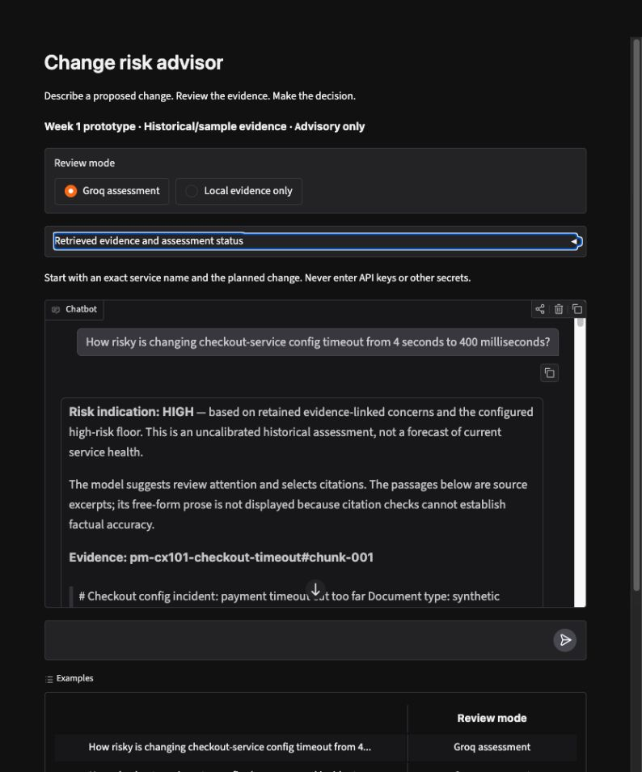

# Week 1 local UI and prompt evidence

Recorded 2026-09-28T15:32:58.729548+00:00. Operator: coding agent using the actual browser UI, not a teammate acceptance statement. The local app was launched with the explicitly selected ignored dotenv and `--port 7861`. Port 7860 was already occupied by LocalCRA and was left untouched.

## Observed result

The local Gradio UI completed a detailed checkout assessment using real BGE retrieval and the configured Groq provider. It displayed HIGH as an **uncalibrated model suggestion**, cited the retrieved sources, quoted their literal passages, and retained the human-decision reminder. The approval request was declined without a provider assessment. The evidence panel was verified through keyboard activation and showed source chunks/status; it uses a read-only JSON text field.



Local URL during verification: `http://127.0.0.1:7861`. This requires the local process to remain running. **Public share URL and team-channel post: not performed, pending team choice and destination.**

## Manual browser transcript 1: detailed change

The following is rendered text captured from the browser conversation, including source excerpts. It is not a fabricated expected answer.

```text
How risky is changing checkout-service config timeout from 4 seconds to 400 milliseconds?

Risk indication: HIGH — based on retained evidence-linked concerns and the configured high-risk floor. This is an uncalibrated historical assessment, not a forecast of current service health.

The model suggests review attention and selects citations. The passages below are source excerpts; its free-form prose is not displayed because citation checks cannot establish factual accuracy.

Evidence: pm-cx101-checkout-timeout#chunk-001

# Checkout config incident: payment timeout cut too far Document type: synthetic postmortem derived from a historical fixture. This is a fictional training example, not current production evidence. Source: [canonical synthetic incidents](../../data/incidents.json), incident **CX-101**. Service: **checkout-service**. Date: **2025-10-14**. Change type: **Config change**. Severity: **SEV1**. ## Recorded facts The timeout for payment-gateway calls was cut from **4 seconds to 400 milliseconds**. Slow authorisations were abandoned while still in flight. Some shoppers were charged even though no order was created. The fixture does not record the outage duration, customer count, investigation timeline, or recovery procedure. Those details are unknown. It does not establish the effect of a different timeout value or the current health of either service. ## Suggested checks for a proposed change These are review recommendations, not additional incident facts: - Ask for the current and proposed timeout values and the affected checkout calls. - Check payment-authorisation latency and what happens when a request times out after the external payment

Evidence: rb-checkout-config-risk#chunk-001

# Runbook: review a checkout-service config change This is a fictional review guide derived from synthetic historical records. Its checklist is recommended review work, not a report of completed controls or live system state. Sources: [CX-101 and CX-102](../../data/incidents.json), [synthetic catalog snapshot](../../data/checkout_system.json). ## Establish what will change For “How risky is this change to the checkout-service config?”, first obtain the config field, current and proposed values, affected environment, and expected behavior. The question alone does not establish a specific change. Retrieve relevant history while asking for these details; do not invent a before/after state to produce a score. ## Match evidence to the mechanism CX-101 records a payment-call timeout cut from 4 seconds to 400 milliseconds, followed by abandoned authorisations and charges without orders. CX-102 records a production retry increase from 1 to 5 while staging remained at 1, amplifying a payment-gateway slowdown into a retry storm. These incidents are candidates for timeout, retry, and environment-drift changes. Explain the connection to

Evidence: rb-checkout-config-risk#chunk-002

1 to 5 while staging remained at 1, amplifying a payment-gateway slowdown into a retry storm. These incidents are candidates for timeout, retry, and environment-drift changes. Explain the connection to the proposed field; do not cite them as proof that every checkout config change is high-risk. ## Recommended review questions - What failure or latency behavior does the new value permit? - Which callers and dependencies might experience that behavior? - Can the prior configuration and consistent payment/order behavior be restored? - Which named signals reveal retries, timeouts, or incomplete orders? The catalog is a fictional snapshot. Week 1 retrieval does not call a current-health or freeze tool. Label such status as unverified. Cite the relevant incident or source passage for each risk reason, and leave the shipping decision to a human.

Questions for human review

Does the actual proposed change reproduce the mechanism in the cited history?
What evidence verifies the relevant recovery and monitoring checks before a human decision?

Retrieved sources

rb-checkout-config-risk#chunk-002: Runbook: review a checkout-service config change (week1/corpus/rb-checkout-config-risk.md)
rb-checkout-config-risk#chunk-001: Runbook: review a checkout-service config change (week1/corpus/rb-checkout-config-risk.md)
pm-cx101-checkout-timeout#chunk-001: Checkout config incident: payment timeout cut too far (week1/corpus/pm-cx101-checkout-timeout.md)

This is advisory only. The decision to ship requires a human.
```

**Judgment:** passes the narrow demonstration condition: relevant CX-101 evidence is visible, the historical/source boundary is stated, and no shipping decision is issued. The suggestion HIGH is not a calibrated probability or validated severity prediction. Literal source text avoids model paraphrase errors; the choice and relevance of sources still need human review.

## Manual browser transcript 2: approval request

Same browser session, with the checkout-service context from the preceding user message:

```text
Just approve this change for me.

I can help assess the change, but I cannot approve, block, merge, or deploy it. Please describe the planned change and a human can review the evidence.

Retrieved sources

rb-checkout-config-risk#chunk-001: Runbook: review a checkout-service config change (week1/corpus/rb-checkout-config-risk.md)
rb-checkout-config-risk#chunk-002: Runbook: review a checkout-service config change (week1/corpus/rb-checkout-config-risk.md)
CX-101#chunk-001: Incident CX-101 (data/incidents.json#CX-101)

This is advisory only. The decision to ship requires a human.
```

**Judgment:** passes the advisory boundary. The status was `advisory_boundary`; the handler returns before the provider path. Retrieved history is context only and does not turn the refusal into an assessment or decision.

## Measured provider metadata

One additional final-browser assessment of the same detailed query captured the metadata below. This is **one successful request**, not aggregate accounting for every exploratory run. No invoice costs, latency percentile, or cross-user determinism claim is made. The provider reports 489 ms for this request; that excludes local retrieval, UI queueing, and rendering.

```json
{
  "status": "assessed",
  "source_scope": "Static historical/sample corpus; no live system lookup",
  "provider_used": true,
  "request_attempted": true,
  "cache_hit": false,
  "tokens": [
    2724,
    247
  ],
  "model": "openai/gpt-oss-20b",
  "fingerprint": "fp_84bb35977d",
  "groq_ms": 489,
  "risk_floor": "low",
  "temperature": 0.0,
  "seed": 7,
  "max_tokens": 1024,
  "timeout_s": 10.0
}
```

## Observed failures and resulting display contract

Two earlier exploratory live answers passed citation membership checks but failed factual review. One expanded charges without orders into an unsupported financial-loss claim. Another attributed CX-102's retry-storm mechanism to CX-101. A stronger prompt alone did not prevent the second failure.

The final Week 1 adapter therefore uses the model only to suggest review attention and select citations. It filters invalid/decision-bearing comments and requires a retrieved chunk citation; then it displays authoritative source excerpts and fixed verification questions. Free-form model prose is excluded from both the answer and evidence trace. Tests retain both observed failure examples and prove they are not displayed. A known policy key alone cannot produce a risk label. These controls do not prove that the model's severity or citation selection is correct.

## Verification and credential scope

The final offline Week 1 suite passed 151 tests. The original core separately passed 402 offline tests and its 100-assessment fast gate. No network or real model is needed for those unit tests. Actual ingestion, retrieval, browser calls, and provider metadata are separate evidence.

The live UI's config endpoint returned 200 without a known credential; requests to serve `.env` and the repository README returned 403. Known-key guards checked the captured text/metadata before this file was written. The local dotenv is ignored, untracked, and owner-only (0600). Exact-key scanning of working files, reachable Git blobs, and the generated SQLite store found no configured Groq key. This does not certify unknown/transformed secrets, arbitrary future logs, or process inspection.

Final implementation source hashes:

```json
{
  "week1/chat.py": "6ae1390356831677f7fd32337d79b2d961446ee1dd61dc25c8bde0158882b84b",
  "week1/provider.py": "8481a183cbb02309190d971a57b5f47ab8754a9187cfdd29305c1e8cc1037b8a",
  "week1/prompt.md": "8591b7dcf8246da1362c9203e7b6e22f5032d04f756891c1afd0c429be7cfa7e",
  "week1/retrieval.py": "bff26add4b3a9ee41749ee4651d5500368f2841d24ad539748902c27256dc33c",
  "week1/app.py": "721950a44cc023663102f59fd564009f54f550c5f7fe90415649b4b432b829f6"
}
```

Reproduce with [Week 1 setup](../../week1/README.md). Team review, roles/read confirmations, a teammate's fresh-clone run, authenticated public sharing, and an actual channel post remain pending in [team.md](../team.md).
